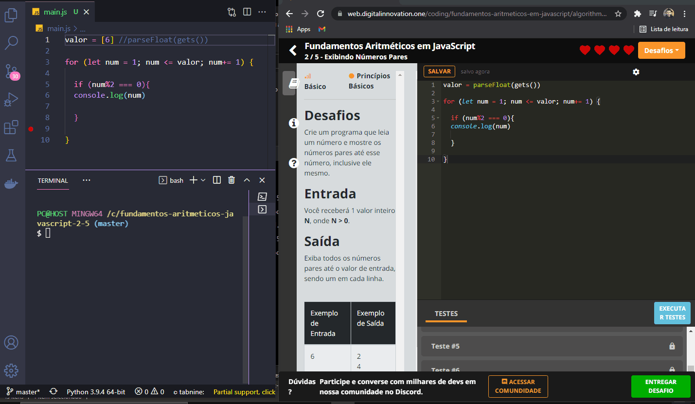

<h1 align="center">
  
   
  JavaScript Arithmetic Fundamentals - 2 / 5 - Showing even numbers
</h1>

<h3 align="justify">
Resolution of the 2/5 challenge of Digital Innovation One's javascript arithmetic fundamentals module.
</h3>

 

## 📷 Demonstration

  

 

## 🚀 Technologies

This project was developed with the following technologies:

- JavaScript
- NodeJs

 

## ⚙ Settings
- New Terminal
 

---

Made with 💜 by Rafael Maciel
